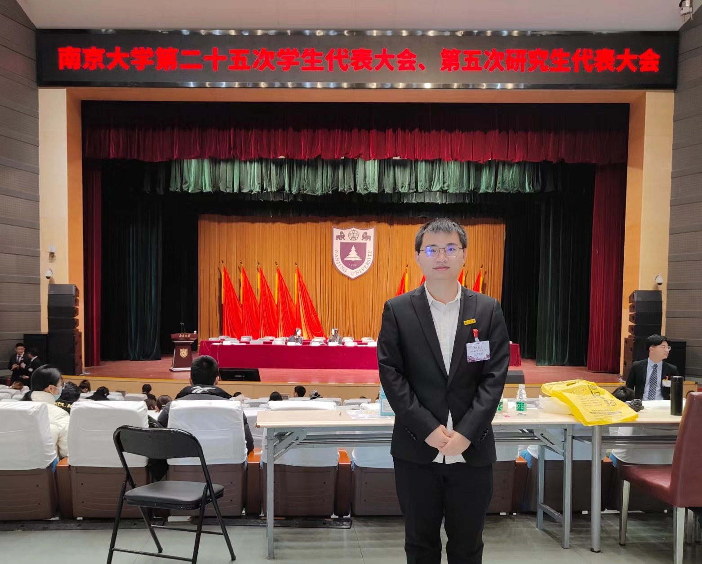

## About Me
<table border="0">
  <tr>
    <td width="75%">
      
<h1>Shizhe LIU (刘世喆)</h1>

      
<b>Ph.D.Student, LANDS Group</b>

      
<b>Nanjing University (NJU)</b>

      
<b>Department of Computer Science & Technology</b>

      
<b>shizheliu@smail.nju.edu.cn</b>

    </td>
    <td width="25%">
      
<h1>Photos</h1>

      
    </td>
  </tr>
</table>

### Biography
I'm a fourth-year Ph.D.student in the Department of Computer Science and Technology, Nanjing University, supervised by professor [Guihai Chen](http://cs.nju.edu.cn/gchen) ([IEEE Fellow](https://www.comsoc.org/membership/ieee-fellows/2023) and [CCF Fellow](https://www.ccf.org.cn/Membership/Individual_member/Honor/2021-07-21/671453.shtml)) and [Haipeng Dai](https://cs.nju.edu.cn/daihp/).

I received my B.Eng. degree from the Software College of [Jilin University](https://www.jlu.edu.cn/) in June 2021 (**GPA Rank 3/353**). In the same year, I was admitted to pursue a Ph.D. in [Nanjing University](https://www.nju.edu.cn/) without an entrance examination.

I always believe that: 
 - **no pain, no gain** (没有痛苦,没有收获)
 - there is no royal road to learning (书山有路勤为径,学海无涯苦作舟)
 - with great power comes great responsibility (能力越强责任越大)

### Interests

1. **Complex Event Processing** [[survey](https://link.springer.com/article/10.1007/s00778-019-00557-w)]
2. **Time Series Database** [[slides](/Introduction_to_Time_Series_Database.pdf)], mainly focus on [IoT (Internet of Things) Database](https://iotdb.apache.org/zh/)
3. **Probabilistic Data Structures**, *e.g.*, Bloom Filter, Sketch [[slides](/sketch.pptx)], and Cuckoo Filter [[slides1](/infocom24.pptx) [slides2] (/eurosys.pptx)]
4. **Database Index Structures**, includes [Timeseries Index](https://link.springer.com/article/10.1007/s00778-019-00573-w) and [B+/LSM Tree Index](https://dl.acm.org/doi/10.1145/3299869.3300097)
5. **Time Series Data Mining** [[slides](/Time_Series_Data_Mining.pdf)]

### Awards & Honors
Nanjing University Presidental Special Scholarship, 2021 [PDF](/credentials/doctor_scholarship.pdf)

Nanjing University Excellent Graduate Student, 2022 [PDF](/credentials/excellent_student.pdf)

Department of Computer Science & Technology Excellent graduate cadres, 2023 [PDF](/credentials/excellent_student_association.pdf)

### Publications

[KDD'24] **Shizhe Liu**, Haipeng Dai, Shaoxu Song, Meng Li, Jingsong Dai, Rong Gu, Guihai Chen. ACER: Accelerating Complex Event Recognition via Two-Phase Filtering under Range Bitmap-Based Indexes. In KDD (CCF A), August 25-29, Barcelona, Spain, 2024. [Video](https://www.youtube.com/watch?v=GW4QsuRyXHc) [Poster](/acer_poster.pdf) [Slides](/acer_slides.pptx) [Code](https://github.com/Josehokec/ACER4CER)

[UbiComp'23] Lihao Wang, Wei Wang, Haipeng Dai, **Shizhe Liu**. MagSound: Magnetic Field Assisted Wireless Earphone Tracking. In UbiCom (CCF A), October 8-12, Cancun, Mexico, 2023. [PDF](https://dl.acm.org/doi/10.1145/3580889) [Video](https://www.youtube.com/watch?v=MLKMuSyfhVc&t=3s)

### Volunteer Service

1. Assistant Reviewer: VLDB, TKDE, INFOCOM, SC, SIGKDD, ICDM *et al*.
2. Teaching Assistant
    * Fundamentals of Computer Systems (For undergraduate students, Fall 2021, Teacher: Haipeng Dai)
    * Distributed Networks (For graduate students, Fall 2022, Teacher: Guihai Chen)
    * Introduction to Database (For undergraduate students, Fall 2023, Teacher: Wenyang Bai)
    * Introduction to Database (For undergraduate students, Fall 2024, Teacher: Wenyang Bai)
3. Part-time counselor (For undergraduate students, Fall 2022 and Spring 2023)

### Correspondence

Please contact me via email: **shizheliu@smail.nju.edu.cn**

### Address
Department of Computer Science, Nanjing University, 163 Xianlin Avenue, Qixia District, Nanjing, China

